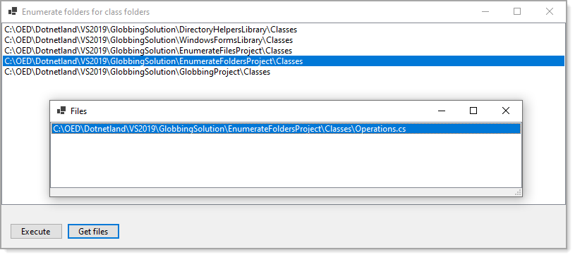
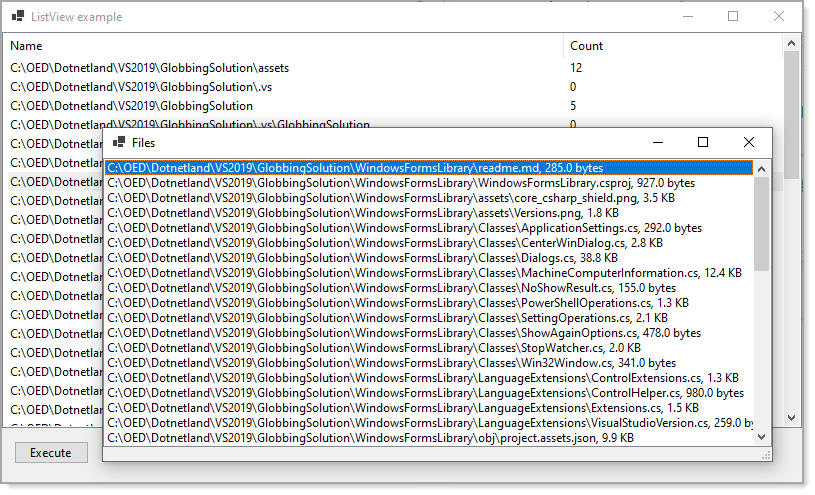

# About

There are two forms, 

**MainForm**

This is a very simple code sample to traverse the solution folder for any project with a Classes folder then provide code to show the files in those folders.

**ListView form**

This code sample goes a bit farther than the code in the `MainForm`. 

While MainForm code is all asynchronous, this code sample mixes asynchronous and synchronous. We don't always need asynchronous code which is the reasoning for mixing this code sample up.

- Double clicking a ListView item shows a form with files and file sizes in the current ListView item.
- Next step is open to opening the select file selected in the child window using [ReadAllTextListAsync](https://github.com/karenpayneoregon/enumeration-globbing-folders-files/blob/master/DirectoryHelpersLibrary/Classes/FileOperations.cs#L32).
- Opening the file can now be searched, viewed or edited. No code to implement as with all code samples in this repository the idea is to provide basics for others to tailor to their needs.

