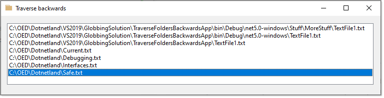

# About

Example to traverse a path in reverse with a stopping point so not to reach passed the upper folder to search.



For instance, we pass in and want to stop at C:\OED

C:\OED\Dotnetland\VS2019\GlobbingSolution\TraverseFoldersBackwardsApp\bin\Debug\net7.0-windows\Stuff\MoreStuff

We pass in the full path and OED for the stopper.

```csharp
public class Operations
{
    /// <summary>
    /// Given a path, traverse backwards until a specific stopping folder name
    /// </summary>
    /// <param name="folder">Folder to traverse backwards</param>
    /// <param name="stopFolder">Folder to stop at</param>
    public static async Task TraverseFolderBackwards(string folder, string stopFolder)
    {
        // get files at lowest level
        await DirectoryOperations2.CollectFiles(folder, "*.txt");

        // split path using the system directory separator character
        var folderParts = folder.Split(Path.DirectorySeparatorChar);
        
        // reverse path to work on folders in reverse order
        Array.Reverse(folderParts);

        foreach (var part in folderParts)
        {
            
            folder = folder.Replace($"{Path.DirectorySeparatorChar}{part}", "");
            // exit processing?
            if (folder == stopFolder)
            {
                return;
            }

            await DirectoryOperations2.CollectFiles(folder, "*.txt");

        }
    }
}
```